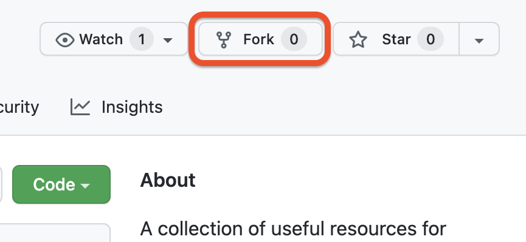
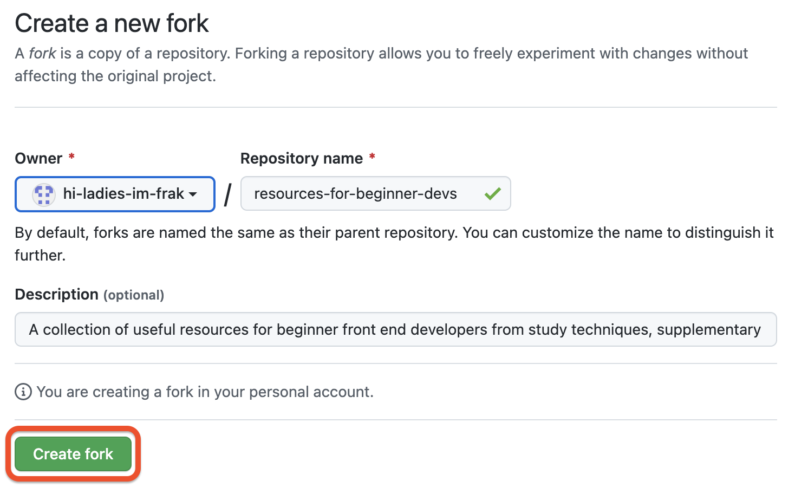
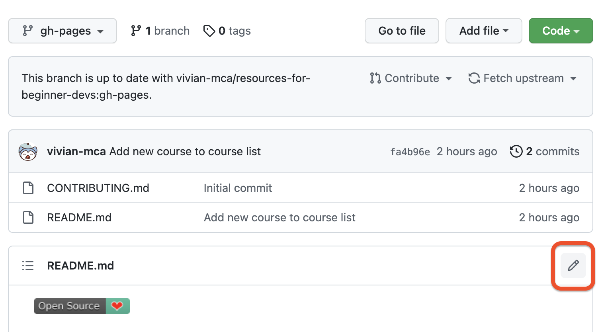
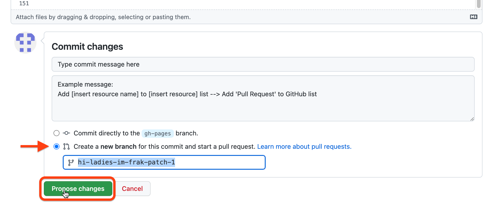
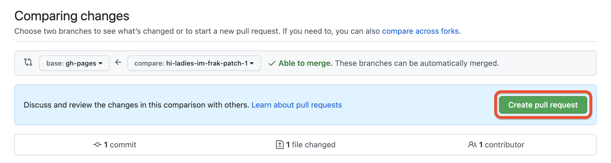
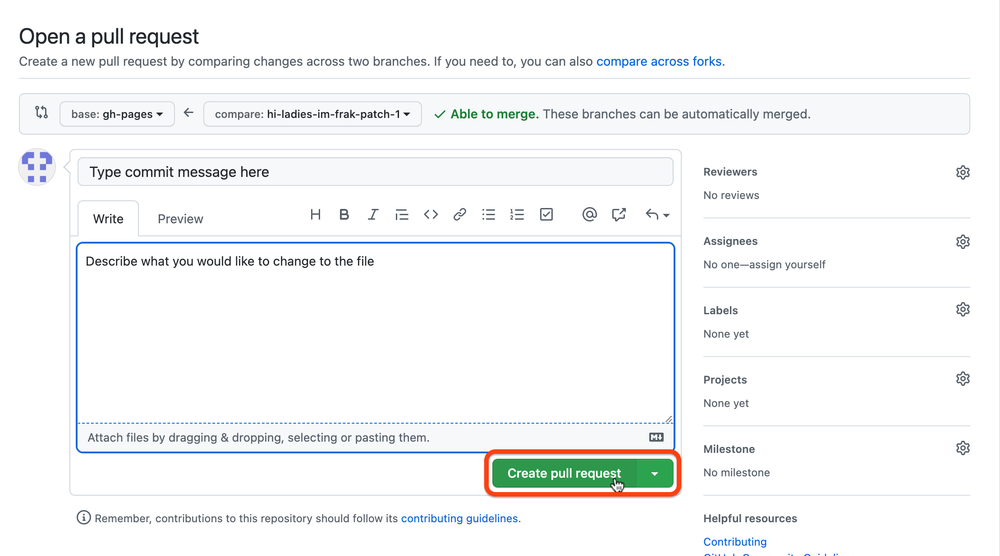
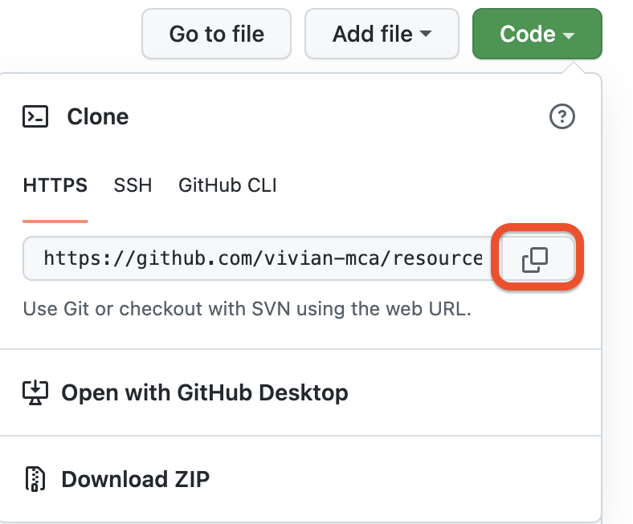
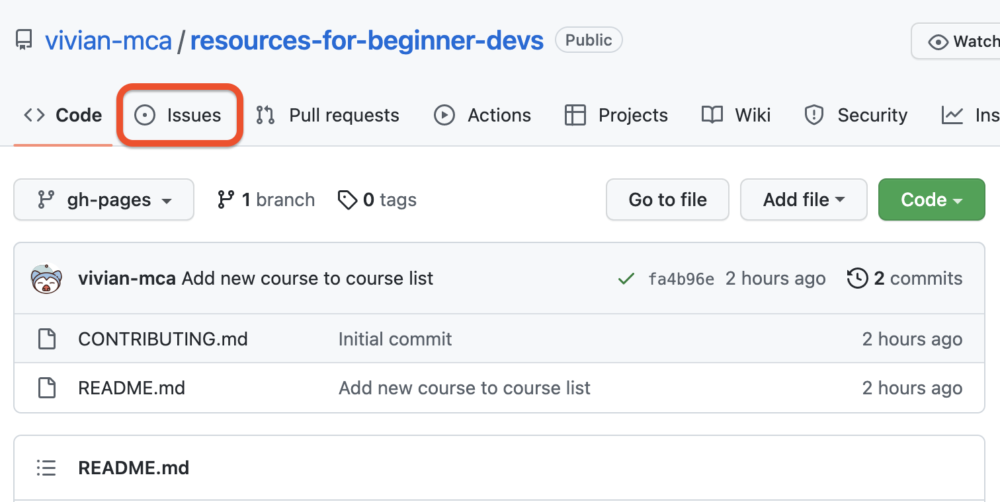

**[:back: Main Page](README.md/)**

<h1 align="center">Contribution Guidelines</h1>

Thank you for taking the time to contribute to this project! :raised_hands:

New to contributions? Please follow the steps below or check out the [Resources](#resources) section.

Familiar with contributions? Please proceed to [Adding new resources](#adding-new-resources), [Submitting a fix](#submitting-a-fix), or [Suggestions](#suggestions).

## Table of Contents <!-- omit in toc -->

- [Pull request using GitHub's Interface](#pull-request-using-githubs-interface)
  - [Fork this repository](#fork-this-repository)
  - [Edit the file](#edit-the-file)
  - [Commit changes and start pull request](#commit-changes-and-start-pull-request)
  - [Create and submit pull request](#create-and-submit-pull-request)
- [Pull request using Git](#pull-request-using-git)
- [Pull request using VSCode](#pull-request-using-vscode)
- [Now what?](#now-what)
- [Adding new resources](#adding-new-resources)
- [Submitting a fix](#submitting-a-fix)
- [Suggestions](#suggestions)
- [Resources](#resources)

## Pull request using GitHub's Interface

This follows the _fork → edit → pull request_ workflow, where the edits are done directly in GitHub. **Note:** This is method is not recommended for editing code. Use this method soley for editing .md files and/or other non-code files.

### Fork this repository

Click on the "**Fork**" button in the upper right corner of the page.

  

You will see the following image shown below. Click "**Create Fork**" to create a fork of this repository.

  

### Edit the file

Choose the file you would like to add resources to or edit. There will be a pencil icon located to the right of the file name header.

  

### Commit changes and start pull request

Once you have made your edits, scroll down and type your commit message. Please make sure to create a meaningful message that aptly and succinctly describes the changes you have made (check the image below for an example). After creating your commit message, choose "**Create a new branch**". You can name this branch whatever you like. This option will also start a pull request for you. Finally, click "**Propose Changes.**"

  

### Create and submit pull request

Once you have started your pull request, you will see the following images. Click "**Create Pull Request**" to submit your pull request.

  

  

## Pull request using Git

Please click [here](https://github.com/firstcontributions/first-contributions/blob/master/README.md). This tutorial follows the _fork → clone → edit → pull request_ workflow. You can make your contribution in the linked repository as well! The url of this repo is:

  

## Pull request using VSCode

Please click [here](https://github.com/firstcontributions/first-contributions/blob/master/gui-tool-tutorials/github-windows-vs-code-tutorial.md). The url of this repo is:

  

## Now what?

Great job, you are now a contributor! Add yourself to the [Contributors](CONTRIBUTORS.md) list.

Your pull request has been submitted and is now being reviewed. Once it has been approved, it will be merged into the main branch. You may delete your branch (created in this [step](#commit-changes-and-start-pull-request)) once your pull request has been merged.

If you are still confused and/or would like to know more about contributions, please check out the [Resources](#resources) section.

## Adding new resources

To add new resources to this project, please follow the steps below.

1. Find the category/categories you would like to add resources to. If you cannot find the category, please proceed to [Suggestions](#suggestions).
2. Check if the resources you would like to add already exists. If not, proceed to step 3.
3. The resources are formatted inside a table. The resource/s you would like to add should be added at the end of the table. It should include:
   - **Name and link** of the resource/s
   - **Type** of the resource/s, ex: video, article, etc.
   - **A brief description** of its contents and other related information

Example of how the **resource should be formatted**:  
`| [Name](https://example.com) | type | A brief description |`

Actual example:  
`| [GitHub Pull Request](https://docs.github.com/en/pull-requests/collaborating-with-pull-requests/proposing-changes-to-your-work-with-pull-requests/about-pull-requests#about-pull-requests) | Documentation | Full documentation about pull requests from GitHub Docs |`

**DON'T FORGET** the pipes (|) at the beginning and end of each row. Please make sure that the resource is formatted correctly and is consistent with the rest of the table.

## Submitting a fix

If you have found an error, broken link, grammar mistakes, bug etc, please feel free to [open an issue](https://github.com/vivian-mca/resources-for-beginner-devs/issues).

The link above should take you there!

  

  

## Suggestions

Not seeing the related category for your resource or you have category suggestions? Please [open an issue](https://github.com/vivian-mca/resources-for-beginner-devs/issues).
## Resources

| Link                                                                                                                            | Type         | Description                                                                   |
| ------------------------------------------------------------------------------------------------------------------------------- | ------------ | ----------------------------------------------------------------------------- |
| [How to Contribute to an Open Source Project](https://egghead.io/courses/how-to-contribute-to-an-open-source-project-on-github) | Video series | Free course that follows a step-by-step approach to open source contributions |
| [GitHub Pull Request](https://docs.github.com/en/pull-requests/collaborating-with-pull-requests/proposing-changes-to-your-work-with-pull-requests/about-pull-requests#about-pull-requests) | Documentation | Full documentation about pull requests from GitHub Docs |
